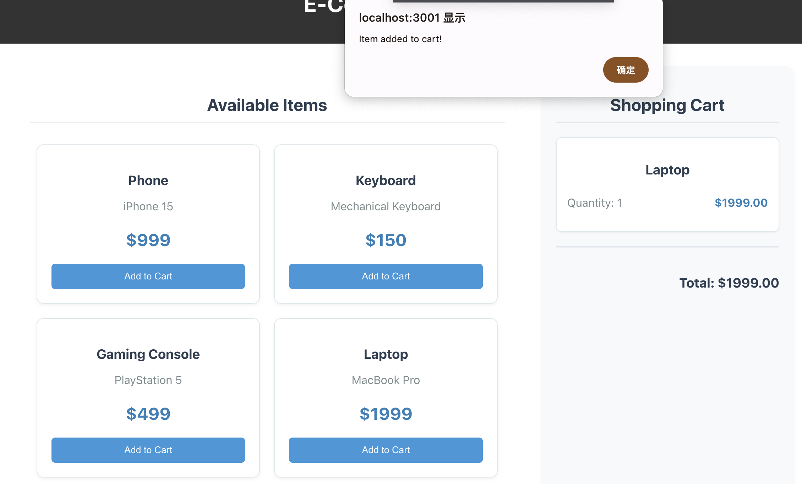
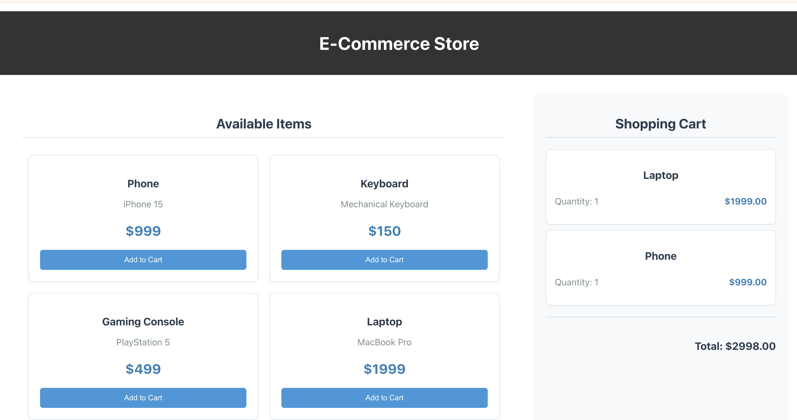
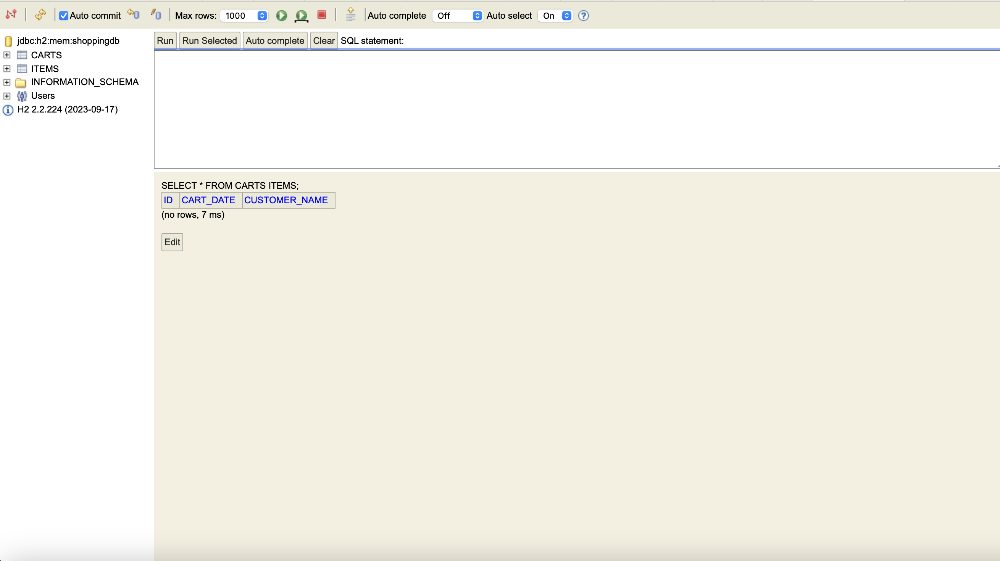

# Shopping Cart Application

A full-stack e-commerce shopping cart application built with Spring Boot backend and React TypeScript frontend.

## Features

- View available items
- Add items to cart
- Remove items from cart
- Calculate total cost
- Persistent data storage with H2 database

## Tech Stack

### Backend
- Java 17
- Spring Boot 3.2.0
- Spring Data JPA
- H2 Database
- Maven

### Frontend
- React 18
- TypeScript
- Axios
- Chakra UI

## Screenshots

### Shopping Cart Interface

*Main interface showing available items and cart functionality*

### Cart with Items

*Shopping cart showing added items and total calculation*

### Database Console

*H2 Database console showing data persistence*

## Project Structure

### Backend

- `backend/`
  - `src/`
    - `main/java/com/jince/shopping/`
      - `config/` - Configuration files
      - `controller/` - Controllers for handling requests
      - `model/` - Data models
      - `repository/` - Database repositories
      - `service/` - Business logic services
      - `ShoppingApplication.java` - Main Spring Boot application file
    - `resources/` - Application resources (e.g., `application.yml`)
  - `pom.xml` - Maven project configuration file

### Frontend

- `frontend/`
  - `src/`
    - `components/` - Reusable React components
    - `services/` - API service calls
    - `types/` - TypeScript types/interfaces
  - `public/` - Static assets and public files
  - `package.json` - Node.js project configuration file


## API Endpoints

- `GET /api/items` - Get all items
- `POST /api/items` - Create new item
- `GET /api/cart/{customerName}` - Get user's cart
- `POST /api/cart/{customerName}/items/{itemId}` - Add item to cart
- `DELETE /api/cart/{customerName}/items/{itemId}` - Remove item from cart

## Setup & Running

### Backend
```bash
cd backend
./mvnw spring-boot:run


Backend will run on http://localhost:8080

Frontend
bashCopycd frontend
npm install
npm start
Frontend will run on http://localhost:3001
Database
H2 Console available at http://localhost:8080/h2-console

JDBC URL: jdbc:h2:mem:shoppingdb
Username: sa
Password: (leave empty)

Development
Prerequisites

Java 17 or higher
Node.js 14 or higher
npm/yarn

Backend Development
The backend uses:

Spring Boot for REST API
JPA for database operations
H2 for in-memory database

Frontend Development
The frontend uses:

React with TypeScript
Axios for API calls
Chakra UI for styling

Testing
Backend Testing
bashCopy./mvnw test
Frontend Testing
bashCopynpm test


